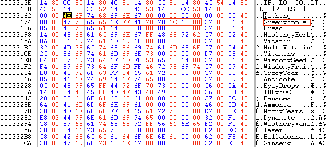
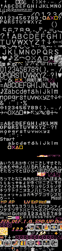
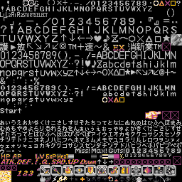
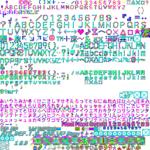
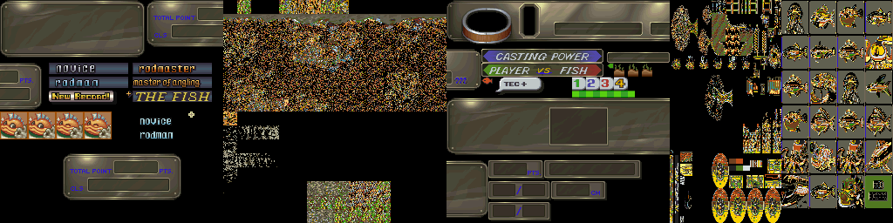
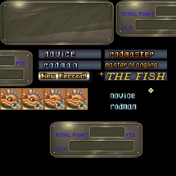
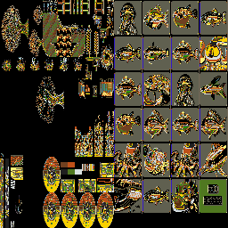
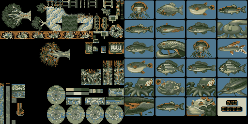

# bof3-translation-tool
Breath of Fire 3 Translation Tool

- [bof3-translation-tool](#bof3-translation-tool)
  - [Introduzione](#introduzione)
  - [Utilizzo](#utilizzo)
    - [Spacchettare file EMI](#spacchettare-file-emi)
    - [Reimpacchattare file EMI](#reimpacchattare-file-emi)
    - [Estrazione del testo](#estrazione-del-testo)
    - [Estrazione del testo manualmente (Raw Dump)](#estrazione-del-testo-manualmente-raw-dump)
    - [Traduzione automatico con Amazon Translate (ML)](#traduzione-automatico-con-amazon-translate-ml)
    - [Reinserimento testo](#reinserimento-testo)
    - [Reinserimento del testo manualmente (Raw Reinsert)](#reinserimento-del-testo-manualmente-raw-reinsert)
    - [Indicizzazione dei testi](#indicizzazione-dei-testi)
    - [Espansione testi indicizzati](#espansione-testi-indicizzati)
    - [Conversione grafica RAW in TIM/BMP](#conversione-grafica-raw-in-timbmp)
    - [Conversione grafica TIM/BMP in RAW](#conversione-grafica-timbmp-in-raw)
    - [Dividere la grafica RAW (split)](#dividere-la-grafica-raw-split)
    - [Riunire le grafiche RAW divise (merge)](#riunire-le-grafiche-raw-divise-merge)
  - [Dump di tutti i testi/grafiche/file binari da modificare](#dump-di-tutti-i-testigrafichefile-binari-da-modificare)
    - [Prerequisiti](#prerequisiti)
    - [Estrazione](#estrazione)
    - [Risultato finale](#risultato-finale)
  - [Reinserimento di tutti i testi/grafiche/file binari modificati](#reinserimento-di-tutti-i-testigrafichefile-binari-modificati)
    - [Prerequisiti](#prerequisiti-1)
    - [Reinserimento](#reinserimento)
    - [Risultato finale](#risultato-finale-1)
  - [Cosa manca](#cosa-manca)

## Introduzione
Questo tool è stato sviluppato per spacchettare e reimpacchettare i file in formato **EMI** di Breath of Fire 3 PSX/PSP. 
Con ogni probabilità funziona anche con Breath of Fire 4 (almeno per la gestione degli **EMI**, non ho verificato testi/grafica).

Oltre alla gestione degli **EMI** supporta anche l'estrazione ed il reinserimento dei testi di gioco presenti nei file **EMI** e permette l'indicizzazione dei testi duplicati nei vari file in un unico file e, viceversa, ne permette l'espansione in multipli file.

Oltre a ciò ingloba anche la gestione della grafica **RAW** in **TIM**/**BMP** ed il riordinamento dei tile al loro interno (le **RAW** non sono "ordinate").

## Utilizzo
L'utilizzo del tool è molto semplice:

```
python bof3tool.py -h
```

Ad esempio mostrerà cosa è in grado di fare;

```
usage: bof3tool.py [-h] [-v] {unpack,pack,dump,rawdump,translate,reinsert,rawreinsert,index,expand,raw2tim,tim2raw,raw2bmp,bmp2raw,split,merge} ...

Breath of Fire III Tool (PSX/PSP)

positional arguments:
  {unpack,pack,dump,rawdump,translate,reinsert,rawreinsert,index,expand,raw2tim,tim2raw,raw2bmp,bmp2raw}
                        Description
    unpack              unpack EMI files into bin files
    pack                pack bin files into EMI file
    dump                dump text from bin file
    rawdump             raw dump bytes from file
    translate           translate a JSON file using Amazon Translate (ML)
    reinsert            reinsert text into bin file
    rawreinsert         raw reinsert bytes into file
    index               index all texts into single file
    expand              expand an indexed file into multiple files
    raw2tim             convert graphic RAW to TIM (PSX)
    tim2raw             convert TIM (PSX) to graphic RAW
    raw2bmp             convert graphic RAW to BMP
    bmp2raw             convert BMP to graphic RAW
    split               split raw image
    merge               merge splitted raw image

optional arguments:
  -h, --help            show this help message and exit
  -v, --version         show program's version number and exit
```

I comandi a disposizione sono:
* **unpack**: estrae il contenuto dei file **EMI**
* **pack**: ricostruisce il file **EMI** precedentemente estratto
* **dump**: estrae il testo da un file **bin** in un file di testo **JSON**
* **rawdump**: estrae sequenze di byte ripetutamente da un file come **JSON**
* **translate**: traduce un file di testo **JSON** utilizzando **Amazon Translate (ML)**
* **reinsert**: converte un file di testo **JSON** in formato **bin**
* **rawreinsert**: reinserisce sequenze di byte ripetutamente in un file da un **JSON**
* **index**: indicizza più file di testo in un unico file (utile per i testi ripetuti)
* **expand**: espande un file indicizzato negli originali file di testo (testi ripetuti)
* **raw2tim**: converte un file grafico **RAW** in formato **TIM** riarraggiando i tile
* **tim2raw**: converte un file in formato **TIM** in grafica **RAW** riarraggiando i tile
* **raw2bmp**: converte un file grafico **RAW** in formato **BMP** riarraggiando i tile
* **bmp2raw**: converte un file in formato **BMP** in grafica **RAW** riarraggiando i tile
* **split**: divide un file grafico **RAW** in più file
* **merge**: unisce più file grafici **RAW** in un unico file

### Spacchettare file EMI
Per estrarre uno o più file **EMI** è sufficiente dare ad esempio un:
```
python bof3tool.py unpack -i BIN/WORLD00/*.EMI -o unpacked/WORLD00
```

Così facendo diremo di spacchettare tutti i file **EMI** contenuti nella cartella `BIN/WORLD00` all'interno della cartella `unpacked/WORLD00`.

All'interno ci troveremo una struttura composta da:
* un file **JSON** contenente le informazioni del file originale
* una cartella contenente i file estratti dall'**EMI**

Se al comando precedente aggiungiamo anche i parametri `--dump-text`, `--dump-graphic` e `--extra-table 9A=à 9B=ò...` avremo inoltre:
* l'eventuale dump del testo rilevato in formato **JSON** (potrebbe non essere testo di gioco ma materiale di debug)
* la grafica esportata in formato **BMP** secondo la mappa dei file conosciuti aventi grafica da tradurre (solo per debug, palette preimpostata)
* nel dump dei testi saranno gestiti eventuali caratteri extra (ad es. le accentate)

Esempio di estrazione di un singolo file:
```
python bof3tool.py unpack -i AREA033.EMI -o unpacked --dump-text --dump-graphic
```

Risultato:
```
--- Breath of Fire III Tool (PSX/PSP) ---

Unpacking AREA033.EMI into unpacked/AREA033.json and data blocks(14)...
--- Breath of Fire III Tool (PSX/PSP) ---

Unpacking AREA033.EMI into unpacked/AREA033.json and data blocks(14)...
unpacked/AREA033/AREA033.1.bin created (Sound)
unpacked/AREA033/AREA033.2.bin created 
unpacked/AREA033/AREA033.3.bin created 
unpacked/AREA033/AREA033.4.bin created 
unpacked/AREA033/AREA033.5.bin created 
unpacked/AREA033/AREA033.6.bin created (RAW Graphic)
Coverting RAW AREA033.6.bin in BMP unpacked/AREA033/AREA033.6.bin.8b.64w.64x32.1024r.bmp using 8bpp, final width size 1024 using tile of 64x32...
Done
unpacked/AREA033/AREA033.7.bin created (CLUTs)
unpacked/AREA033/AREA033.8.bin created (RAW Graphic)
Coverting RAW AREA033.8.bin in BMP unpacked/AREA033/AREA033.8.bin.8b.64w.64x32.1024r.bmp using 8bpp, final width size 1024 using tile of 64x32...
Done
unpacked/AREA033/AREA033.9.bin created (CLUTs)
unpacked/AREA033/AREA033.10.bin created 
unpacked/AREA033/AREA033.11.bin created 
unpacked/AREA033/AREA033.12.bin created (Text blocks)
Dumping 256 strings from block0 of unpacked/AREA033/AREA033.12.bin into unpacked/AREA033/AREA033.12.bin.json...
Text dumped
unpacked/AREA033/AREA033.13.bin created 
unpacked/AREA033/AREA033.14.bin created 
EMI AREA033.EMI unpacked into 14 files
```

### Reimpacchattare file EMI
Una volta estratti i file **EMI** nei rispettivi **bin** è possibile ricostruirne uno o più **EMI** utilizzando il seguente comando:

```
python bof3tool.py pack -i unpacked/AREA000.json -o output
```

Il risultato che otterremo sarà:
```
--- Breath of Fire III Tool (PSX/PSP) ---

Packing unpacked/AREA000.json into output/AREA000.EMI...
output/AREA000.EMI created.
```

> **ATTENZIONE**: potrebbe capitare che durante la traduzione dei testi il nuovo file da reinserire sia più grande dell'originale.
>
> In questo caso il tool applicherà la seguente logica:
> - se il file è di poco più grande e può rientrare nel padding originale del blocco (i blocchi sono da 2048 byte) verrà reinserito senza problemi poiché consuma il padding già presente
> - se il file supera la dimensione originale e consuma tutto il padding disponibile allora il file all'interno dell'**EMI** verrà espanso in automatico purché sia minore del **limite massimo di 0x5800 (22528) byte**.
> - se il file **supera** il **limite di 0x5800 (22528)** byte il reimpacchettamente andrà in **errore**

### Estrazione del testo
Per estrarre il testo di gioco nel formato **puntatori+testo** possiamo utilizzare il comando `dump` sul file **bin** contenente il testo:

```
python bof3tool.py dump -i unpacked/AREA000/AREA000.12.bin -o AREA000.12.bin.json --extra-table 9A=à 9B=ò...
```

Il risultato che otterremo sarà:
```
--- Breath of Fire III Tool (PSX/PSP) ---

Dumping 256 strings from block0 of unpacked/AREA000/AREA00.12.bin into unpacked/AREA000/AREA000.12.bin.json...
Text dumped.
```

Il **file JSON** creato conterrà il testo codificato in **UTF-8** e tutti i comandi (pause, posizioni, nomi etc) come ad esempio:

```json
{
  "block0": [
      "<POS 81>   Spring in McNeil<TIME 20><END>",
      "\"Ah...spring...<END>",
      "\"It looks like it'll<NL>be a good crop this<NL>year...<CLEAR>That means we can<NL>take it easy this<NL>year!<END>",
      "\"Not only do we have<NL>to worry about bad<NL>crops...<CLEAR>In the country, we've<NL>got taxes to<NL>worry about too...<CLEAR>I wish I could move<NL>to a real city...<NL>like Wyndia<END>",
      "\"I guess y'all aren't<NL>as bad as I thought...<CLEAR>Good job!<END>",
      "\"What're you doing,<NL>this time of night?<CLEAR>Sleep during the day<NL>an' stay up all night?<NL>S'weird, if ya ask me<END>",
      ...
  ]
}
```

Inoltre se è stato aggiunto il parametro opzionale `--extra-table` saranno dumpati anche eventuali caratteri extra come ad es. le accentate del precedente esempio.

### Estrazione del testo manualmente (Raw Dump)
Molti file binari del gioco presentano del testo al loro interno, tuttavia essi non sono il solito schema puntatori+testo ma sono pezzi di eseguibili PSX/PSP che necessitano di essere modificati manualmente. Al loro interno si possono notare degli schemi ripetuti a distanze fisse. La funzionalità `rawdump` serve proprio a gestire queste situazioni.

Un esempio di file 'grezzo' contenente dei testo è **GAME.1.bin** (di seguito quello estratto dalla versione **PSX NTSC/USA**):



Come si può notare il blocco di testo non è all'inizio del file ma parte da un **offset** più avanti (**0x33164**) ed inizia dalla parola ***Nothing*** ed è sempre incasellato in **quantità** da 12 byte, **ripetuto** per diverse righe. Per passare da un oggetto all'altro dobbiamo **saltare** 6 ulteriori byte per raggiungere l'oggetto successivo.

Se volessimo estrarre questo blocco di testo possiamo utilizzare ad es. il seguente comando:

```
python bof3tool.py rawdump -i GAME.1.bin -o GAME.1.bin.items.json --offset 0x33164 --quantity 12 --skip 6 --repeat 92 --trim
```

Il risultato sarà:
```
--- Breath of Fire III Tool (PSX/PSP) ---

Raw dumped 12 byte from GAME.1.bin into GAME.1.bin.items.json 92 times.
```

Così facendo otterremo un **file JSON GAME.1.bin.items.json** contenente i 92 oggetti estratti dal file originale avente questa forma:

```json
{
    "data": {
        "input": "GAME.1.bin",
        "offset": 209252,
        "quantity": 12,
        "skip": 6,
        "repeat": 92
    },
    "dump": [
        "Nothing",
        "Green Apple",
        "Bread",
        "Healing Herb",
        "Vitamin",
        "MultiVitamin",
        "Vitamins",
        ...
    ]
}
```

> **ATTENZIONE**: al fondo del comando è presente un `--trim`, esso serve a rimuovere i **byte 0x00** in eccesso al raggiungimento dei 12 caratteri.
> 
> Inolre bisogna fare attenzione che **non è possibile superare il limite fisico di 12 byte** in fase di traduzione (per questo esempio).

> **ATTENZIONE**: anche in questo caso è possibile sfruttare il parametro `--extra-table` per aggiungere ulteriori caratteri all'estrazione.

All'interno del **file JSON** generato saranno presenti tutte le informazioni necessarie al reinserimento del testo in quello specifico file. Possiamo immaginarlo come una sorta di ***patch*** da applicare al file originale.

### Traduzione automatico con Amazon Translate (ML)
Utilizzando la funzione `translate` è possibile automatizzare la traduzione del testo sfruttando il Machine Learning di Amazon Translate.

L'utilizzo richiede la creazione di un **account AWS** e la **configurazione dell'AWS CLI** localmente sul proprio computer.

> **ATTENZIONE**: la traduzione automatica è utile solo per avere una "prima bozza" dei testi tradotti e/o giusto per avere un confronto con ciò che verrebbe automaticamente tradotto con l'utilizzo del Machine Learning  ad inizio 2023.
>
> La traduzione proposta contiene errori vari come:
> - traduzione decontestualizzata e/o non corretta
> - caratteri trasformati/persi (ad es. le doppie virgolette)
> - spazi bianchi aggiunti dove non serve (e quindi spazio sprecato)
> - codici di controllo spostati, etc.

L'utilizzo è molto semplice:
```
python bof3tool.py translate -h
```

```
usage: bof3tool.py translate [-h] -i INPUT [-o OUTPUT] [--source-language SOURCE_LANG] --target-language TARGET_LANG [--verbose]

optional arguments:
  -h, --help            show this help message and exit
  -i INPUT, --input INPUT
                        input .JSON file
  -o OUTPUT, --output OUTPUT
                        output .JSON file
  --source-language SOURCE_LANG
                        source language code (default en)
  --target-language TARGET_LANG
                        target language code (fr, de, it...)
  --verbose             show verbose logs
```

Ad esempio per tradurre tutti i testi indicizzati in un unico file:
```
python bof3tool.py translate -i strings_en.json -o strings_it.json --target-language it
```

Dopo qualche minuto (dipende da quante righe di testo volete tradurre) otterremo:
```
--- Breath of Fire III Tool (PSX/PSP) ---

Translating 6366 strings of blocks from 'en' to 'it' using Amazon Translate (ML)...
File strings_en.json translated into strings_it.json from 'en' to 'it' using Amazon Translate (ML).
6365 strings translated for a total of 608684 characters.
```

Ribadisco: la traduzione proposta **va controllata frase per frase e corretta**.

Nel repository, all'interno della cartella ***autotranslate*** potete trovare i testi originali del gioco versione PSX nel file `strings_en.json` e la **traduzione italiana da revisionare** proposta da Amazon Translate nel file `strings_it.json`.

### Reinserimento testo
Allo stesso modo è possibile ricostruire un file **bin** di testo partendo da un **JSON** utilizzando:

```
python bof3tool.py reinsert -i AREA000.12.bin.json -o AREA000.12.bin --extra-table 9A=à 9B=ò...
```

Il risultato che otterremo sarà:
```
--- Breath of Fire III Tool (PSX/PSP) ---

Reinserting 256 strings from block0 of AREA000.12.bin.json into AREA000.12.bin...
Text reinserted.
```

Anche in questo caso la presenza del parametro opzionale `--extra-table` permette di gestire eventuali caratteri UTF8 presenti nel dump con i suoi corrispettivi valori byte (ad es. la lettera **à** verrà inserite come byte **0x9A** e via dicendo).

Il nuovo file **bin** ottenuto potrà essere reinserito nel file **EMI**.

### Reinserimento del testo manualmente (Raw Reinsert)
Se abbiamo estratto del testo utilizzando la modalità **Raw Dump** ed intendiamo reinserirlo nel file originale di provenienza possiamo utilizzare la funzionalità di `rawreinsert`.

Il suo funzionamento richiedere il **file JSON** contenente le modifiche da applicazre ed opzionalmente il **file originale** (se diverso da quello specificato nel **JSON**).

Per procedere al reinserimento possiamo utilizzare il comando `rawreinsert`:

```
python bof3tool.py rawreinsert -i GAME.1.bin.items.json
```

> **ATTENZIONE**: possiamo aggiungere il parametro `-b nomefile` o `--bin nomefile` per indicare il file da modificare.

Il risultato che otterremo sarà:
```
--- Breath of Fire III Tool (PSX/PSP) ---

Raw reinserted 12 byte of new encoded text from GAME.1.bin.items.json into GAME.1.bin 92 times.
```

> **ATTENZIONE**: anche in questo caso è possibile sfruttare il parametro `--extra-table` per aggiungere ulteriori caratteri nell'inserimento.

### Indicizzazione dei testi
Moltissimi file di testo di Breath of Fire III contengono del testo ripetuto in quanto sono semplicemente le medesime scene con leggere variazioni (tempo/personaggi).

Al fine di evitare di ritradurre le stesse frasi più e più volte è possibile indicizzarle in un unico grande file che conterrà, di fatto, il testo di tutto il gioco più un file di "puntatori" per l'espansione futura.

Una volta raggruppati i **JSON** di tutti i testi in una cartella è sufficiente eseguire il seguente comando per indicizzare tutti i file:
```
python bof3tool.py index -i texts/*.json --output-strings strings_en.json --output-pointers pointers_en.json
```

Il risultato sarà ad esempio:
```
--- Breath of Fire III Tool (PSX/PSP) ---

Indexing 169 JSON files into strings_en.json/pointers_en.json...
Indexed 6365 strings (4475 repeated strings) for block0.
```

### Espansione testi indicizzati
Da un file di testo indicizzato e dai suoi "puntatori" è possibile riottenere i file **JSON** originali da poter ritrasformare nei **bin** da reinserire negli **EMI**.

Per effettuare l'espansione possiamo utilizzare il seguente comando:
```
python bof3tool.py expand --input-strings strings_en.json --input-pointers pointers_en.json -o expanded
```

Il comando ricostruirà i file **JSON** originale all'interno della cartella `expanded`:

```
--- Breath of Fire III Tool (PSX/PSP) ---

Expanding 169 files...
File AREA000.12.bin.json with 256 strings recreated.
File AREA001.12.bin.json with 256 strings recreated.
File AREA002.8.bin.json with 256 strings recreated.
...
File AREA198.12.bin.json with 256 strings recreated.
File AREA199.12.bin.json with 256 strings recreated.
Expanded 169 files using 10840 indexed strings.
```

### Conversione grafica RAW in TIM/BMP
Tramite le funzioni `raw2tim` e `raw2bmp` è possibile convertire la grafica **RAW** in **TIM**/**BMP** e riarrangiare le tile internamente.

Per spiegarne il funzionamento e mostrarne l'utilizzo prenderemo come esempio il file `ETC/FIRST.EMI` della versione PSX.
Iniziamo con estrarne il suo contenuto:

```
python bof3tool.py unpack -i FIRST.EMI   
```

Otterremo:
```
--- Breath of Fire III Tool (PSX/PSP) ---

Unpacking FIRST.EMI into FIRST.json and data blocks(14)...
FIRST/FIRST.1.bin created (Sound)
FIRST/FIRST.2.bin created 
FIRST/FIRST.3.bin created 
FIRST/FIRST.4.bin created (RAW Graphic)
FIRST/FIRST.5.bin created (RAW Graphic)
FIRST/FIRST.6.bin created (RAW Graphic)
FIRST/FIRST.7.bin created (RAW Graphic)
FIRST/FIRST.8.bin created (RAW Graphic)
FIRST/FIRST.9.bin created (CLUTs)
FIRST/FIRST.10.bin created (CLUTs)
FIRST/FIRST.11.bin created (CLUTs)
FIRST/FIRST.12.bin created (Text blocks)
FIRST/FIRST.13.bin created (RAW Graphic)
FIRST/FIRST.14.bin created (CLUTs)
EMI FIRST.EMI unpacked into 14 files
```
Alcuni di questi file contengono **grafica RAW** mentre altri contengono le **CLUT** (i dettagli sono presenti anche nel **JSON** `FIRST.json`), come ad esempio il file `FIRST.4.bin`.

Vediamo quindi cosa è possibile fare con la funzione `raw2tim`:

```
python bof3tool.py raw2tim -h
```

```
usage: bof3tool.py raw2tim [-h] -i [INPUT ...] [-o OUTPUT] --bpp {4,8} --width {64,128,256,512} [--tile-width TILE_W] [--tile-height TILE_H] [--resize-width RESIZE_WIDTH] [--clut CLUT]

optional arguments:
  -h, --help            show this help message and exit
  -i [INPUT ...], --input [INPUT ...]
                        input .bin (RAW) files
  -o OUTPUT, --output OUTPUT
                        output .TIM (PSX) file
  --bpp {4,8}           bits per pixel
  --width {64,128,256,512}
                        image width
  --tile-width TILE_W   tile width
  --tile-height TILE_H  tile height
  --resize-width RESIZE_WIDTH
                        resize width
  --clut CLUT           import CLUTs file
```

Possiamo quindi provare a convertire il file in **TIM** (o **BMP**) usando:
```
python bof3tool.py raw2tim -i FIRST/FIRST.4.bin --bpp 4 --width 128 --clut FIRST/FIRST.9.bin
````

> Per ottenere una **BMP** è sufficiente utilizzare `raw2bmp` con gli stessi parametri ad eccezione di `--clut`

Otterremo una **TIM**:
```
--- Breath of Fire III Tool (PSX/PSP) ---

Coverting RAW FIRST.4.bin in TIM FIRST/FIRST.4.bin.4b.128w.tim using 4bpp, size 128x512...
Done
```

L'immagine che otterremo sarà la seguente:



Come possiamo notare l'immagine è corretta a livello di impostazioni ma è evidente che è suddivisa internamente in tile da 128x32 (il secondo blocco in verticale dovrebbe essere in realtà spostato a destra del primo blocco) secondo questo criterio:
- Tile 1
- Tile 2
- Tile 3
- Tile 4
- Tile 5
- Tile 6
- Tile 7
- Tile 8
- ...

Dovrebbe diventare:
- Tile 1 - Tile 2
- Tile 3 - Tile 4
- Tile 5 - Tile 6
- Tile 7 - Tile 8
- ...

Ecco quindi che è possibile riarrangiare le tile internamente specificando la dimensione delle tile (128x32 in questo caso) e la larghezza finale dell'immagine (256):

```
python bof3tool.py raw2tim -i FIRST/FIRST.4.bin --bpp 4 --width 128 --tile-width 128 --tile-height 32 --resize-width 256 --clut FIRST/FIRST.9.bin
```

Otterremo:
```
--- Breath of Fire III Tool (PSX/PSP) ---

Coverting RAW FIRST.4.bin in TIM FIRST/FIRST.4.bin.4b.128w.128x32.256r.tim using 4bpp, final width size 256 using tile of 128x32...
Done
```

La nuova immagine riarrangiata sarà:



Decisamente meglio, no?

> Quando si lavora con le **BMP** è possibile passare il parametro `--negative` per utilizzare una palette dei colori negativa, ad esempio:
> 
> 
> 
> Con le **TIM** ciò non è necessario in quanto le **TIM** generate possiedono già le due palette predefine o le **CLUT** importate all'interno.

### Conversione grafica TIM/BMP in RAW
Tramite le funzioni `tim2raw` e `bmp2raw` possiamo effettuare il processo inverso al precedente.

I parametri sono praticamente gli stessi:

```
python bof3tool.py tim2raw -h
```

```
usage: bof3tool.py tim2raw [-h] -i [INPUT ...] [-o OUTPUT] --bpp {4,8} [--tile-width TILE_W] [--tile-height TILE_H] [--resize-width RESIZE_WIDTH]

optional arguments:
  -h, --help            show this help message and exit
  -i [INPUT ...], --input [INPUT ...]
                        input .TIM (PSX) files
  -o OUTPUT, --output OUTPUT
                        output .bin (RAW)
  --tile-width TILE_W   tile width
  --tile-height TILE_H  tile height
  --resize-width RESIZE_WIDTH
                        resize width
```

Seguendo l'esempio precedente possiamo riottenere il file RAW (**bin**) eseguendo un:

```
python bof3tool.py tim2raw -i FIRST.4.bin.4b.128w.128x32.256r.tim -o FIRST.4.bin --tile-width 128 --tile-height 32 --resize-width 128
```

> **ATTENZIONE**: prestare attenzione a `--resize-width` che torna ad essere **128** come la `--width` originale (quando è stato effettuato il raw2tim) poiché dobbiamo riarrangiare i tile come nel file originale.

Otterremo:
```
--- Breath of Fire III Tool (PSX/PSP) ---

Extracting TIM info from FIRST.4.bin.4b.128w.128x32.256r.tim...
Coverting TIM FIRST.4.bin.4b.128w.128x32.256r.tim in RAW graphic FIRST.4.bin using 8bpp, final width size 128 using tile of 128x32...
Done
```

Ed ecco che il file `FIRST.4.bin` è pronto ad essere reinserito nell'**EMI** originale.

> Anche in questo caso il processo con le BMP è il medesimo utilizzando `raw2bmp`. L'unica accortezza è quella di specificare anche i bitplane utilizzati tramite `--bpp`.
> 
> **ATTENZIONE**: se state convertendo una BMP "negativa" non c'è bisogno di specificare alcun ulteriore parametro in quanto la palette dei colori non è presente nella RAW.

### Dividere la grafica RAW (split)
Alcune volte si possono riscontare delle grafiche **RAW** un po' particolari, come ad esempio `AREA030.14.bin`.

Convertiamo nel classico modo:
```
python bof3tool.py raw2tim -i AREA030.14.bin --bpp 8 --width 64 --tile-width 64 --tile-height 32 --resize-width 1024 --clut AREA030.15.bin
```

Risultato:
```
--- Breath of Fire III Tool (PSX/PSP) ---

Coverting RAW AREA030.14.bin in TIM AREA030.14.bin.8b.64w.64x32.1024r.tim using 8bpp, final width size 1024 using tile of 64x32...
Done
```

L'immagine che ne viene fuori è la seguente:



Come chiaramente si nota sembra a tutti gli effetti una immagine **composta da quattro immagini distinte**.

Attenzione però ad un dettaglio, la **quarta immagine** non è pensata per essere renderizzata a **8BPP** ma bensì a **4BPP** poiché l'intera texture che stiamo manipolando verrà divise in **pagine** all'interno della **VRAM**.

Ecco che a questo punto ci viene in aiuto la funzionalità di `split` delle immagini **RAW** (che ricordo essere arrangiate in modo particolare all'interno dei file):

```
python bof3tool.py split -i AREA030.14.bin -o . --bpp 8 --tile-width 64 --tile-height 32 --resize-width 1024 --quantity 4
```

Risultato:

```
--- Breath of Fire III Tool (PSX/PSP) ---

Splitting RAW AREA030.14.bin into 4 parts using 64x32 tile from original width of 1024...
Done
```

In questo modo stiamo chiedendo di dividerci la **RAW riarrangiata** in 4 immagini (che avranno larghezza 256 pixel): `AREA030.14.bin.1`, `AREA030.14.bin.2`, `AREA030.14.bin.3` e `AREA030.14.bin.4`.

> **ATTENZIONE**: possiamo specificare una cartella di destinazione diversa con il parametro `--output`, in alternativa verrà usato il nome del file di input senza estensione.
> 
> Nell'esempio appena mostrato abbiamo usato il **. (punto)** per indicare la **cartella corrente**.

A questo punto possiamo provare a convertire come al solito le **RAW risultanti** tenendo conto delle nuova larghezza:

```
python bof3tool.py raw2tim -i AREA030.14.bin.1 --bpp 8 --width 64 --tile-width 64 --tile-height 32 --resize-width 256 --clut AREA030.15.bin
```

Risultato:

```
--- Breath of Fire III Tool (PSX/PSP) ---

Coverting RAW AREA030.14.bin.1 in TIM AREA030.14.bin.1.8b.64w.64x32.256r.tim using 8bpp, final width size 256 using tile of 64x32...
Done
```

Che corrisponde alla seguente immagine:



Ovviamente se ripetessimo lo stesso comando per la **quarta** avremmo lo stesso problema dell'inizio:
```
python bof3tool.py raw2tim -i AREA030.14.bin.4 --bpp 8 --width 64 --tile-width 64 --tile-height 32 --resize-width 256 --clut AREA030.15.bin
```

Risultato:
```
--- Breath of Fire III Tool (PSX/PSP) ---

Coverting RAW AREA030.14.bin.4 in TIM AREA030.14.bin.4.8b.64w.64x32.256r.tim using 8bpp, final width size 256 using tile of 64x32...
Done
```

Che corrisponde alla seguente immagine:



Tuttavia sarà sufficiente convertirla con le giuste impostazioni:
```
python bof3tool.py raw2tim -i AREA030.14.bin.4 --bpp 4 --width 128 --tile-width 128 --tile-height 32 --resize-width 512 --clut AREA030.15.bin
```

Risultato:
```
--- Breath of Fire III Tool (PSX/PSP) ---

Coverting RAW AREA030.14.bin.4 in TIM AREA030.14.bin.4.4b.128w.128x32.512r.tim using 4bpp, final width size 512 using tile of 128x32...
Done
```

Così facendo otterremo l'immagine corretta (ricordate che sono multi palette, i colori posso differire nelle **BMP** qui mostrate):



### Riunire le grafiche RAW divise (merge)
Se abbiamo utilizzato la funzionalità precedente per dividere una **RAW** in più immagini al fine di modificarle e vogliamo riottenere il file iniziale possiamo utilizzare la funzionalità di `merge` per ricostruire il file:

```
python bof3tool.py merge -i AREA030.14.bin.1 AREA030.14.bin.2 AREA030.14.bin.3 AREA030.14.bin.4 --bpp 8 --tile-width 64 --tile-height 32 --resize-width 1024
```

Risultato:

```
--- Breath of Fire III Tool (PSX/PSP) ---

Merging 4 files into AREA030.14.bin using 64x32 tile from original width of 1024...
Done
```

Ed ecco che verrà ricostruito il file originale `AREA030.14.bin` a partire dalle immagini separate.

> **ATTENZIONE**: ricordate di utilizzare il giusto `--resize-width` che sarà la somma di tutte le larghezze di tutte le immagini.
>
> Inoltre, utilizzando il parametro `--output` possiamo specificare un nome per il file di output, in alternativa verrà usato il nome del primo file da mergiare privato dell'estensione.

## Dump di tutti i testi/grafiche/file binari da modificare
All'interno del repository viene fornito uno script `dump.sh` bash che automatizza l'esportazione di tutti i contenuti che andranno tradotti/modificati.

L'utilizzo dello script è pensato per essere eseguire tramite un **terminale bash** e sfrutta varie utiliy UNIX (ad es. find e rsync) ma dovrebbe essere cross compatibile su **Windows**, **Linux** e **MacOS** (a patto di avere il terminale a disposizione).

### Prerequisiti
Lo script `dump.sh` è pensato per essere eseguito su una cartella contenente la struttura dei file di **Breath of Fire 3** **PSX** o **PSP**.

Immaginando di avere la **ISO** del gioco (**PSX PAL**, **PSX USA** o **PSP**) a disposizione sarà necessario esportare la cartella `BIN` (per le versioni **PSX**) o la cartella `USA` (per la versione **PSP**) e rinominarle rispettivamente **PSX_PAL**, **PSX_USA** o **PSP**.

> Potete copiare la cartella **PSX_PAL**/**PSX_USA**/**PSP** direttamente in questo repository.

Ad es. ci ritroveremo con una cartella avente questa struttura:

- PSX_PAL
  - BATTLE
  - BENEMY
  - BGM
  - BMAG_XA
  - BMAGIC
  - BOSS
  - BPLCHAR
  - ETC
  - PLCHAR
  - SCE_XA
  - SCENARIO
  - WORLD00
  - WORLD01
  - WORLD02
  - WORLD03
  - WORLD04

A questo punto siamo pronti per l'estrazione.

### Estrazione
Per effettuare l'esportazione dei contenuti è sufficiente lanciare il tool sulla cartella originale:

```./dump.sh PSX_PAL```

Lo script inizierà a lavorare sul contenuto della cartella del gioco effettuando questi passaggi:

1. Cancellazione dei file/cartelle non necessari/e
2. Spacchetta tutti i file **.EMI** e dumpa testo
3. Sposta i dump del gioco e dei menu nelle cartelle finali
4. Estrae i nomi di tutti i nemici
5. Estrae manualmente alcuni pezzi di menu dai file binari
6. Copia e splitta tutte le grafiche **RAW**
7. Converte le grafiche **RAW** in **TIM**
8. Sposta le grafiche **TIM** nelle cartelle finali
9.  Copia i file binari da modificare manualmente
10. Crea le cartelle per l'injecting dei file (prima e/o dopo il reinsert)
11. Indicizza i dump di gioco, menu e nemici

### Risultato finale
Al termine della procedura otterremo le seguenti cartelle/file:

- BINARY
  - PSX_PAL
    - BATTLE.16.bin (**da modificare**)
    - MAGIC003.4.bin (**da modificare**)
    - ...
- DUMP
  - PSX_PAL
    - BINARY
      - GAME.1.bin.abilities.json (**da modificare**)
      - GAME.1.bin.accessories.json (**da modificare**)
      - ...
    - dump_enemies.json (**da modificare**)
    - dump_menu.json (**da modificare**)
    - dump_world.json (**da modificare**)
    - pointers_enemies.json (*da ignorare*)
    - pointers_menu.json (*da ignorare*)
    - pointers_world.json (*da ignorare*)

- GFX
  - PSX_PAL
    - AREA016.6.bin.1.8b.64w.64x32.256r.tim (**da modificare**)
    - AREA016.8.bin.4.2.8b.64w.64x32.128r.tim (**da modificare**)
    - ...
- INJECT (*cartella vuota da **utilizzare per injectare i file***)
  - PSX_PAL
    - BEFORE_REINSERT(file da sostituire prima del raw reinsert)
      - Vuota
    - AFTER_REINSERT (file da sostituire dopo il raw reinsert)
      - Vuota
- UNPACKED (*cartella da ignorare*)
  - PSX_PAL
    - BATTLE
    - BMAGIC
    - ...

Ho evidenziato tutte le risorse che andranno modificate prima di effettuare il reinserimento dei contenuti.

> **ATTENZIONE**: le cartelle `BEFORE_REINSERT` e `AFTER_REINSERT` sono utilizzate per la sostituzione di file binari in due fasi distinte.
> 
> Tutti i file contenuti nella cartella `BEFORE_REINSERT` saranno utilizzati come base prima dell'operazione di Raw Reinsert: possiamo quindi inserire al suo interno dei file già modificati (ad es. con editor esadecimali) che dovranno a loro volta essere manipolati dal processo di Raw Reinsert per inserire del nuovo testo.
> 
> Tutti i file contenuti nella cartella `AFTER_REINSERT` sostituiranno i precedenti creati/modificati. In parole semplici saranno loro quelli reimpacchettati nei file **EMI** finali.

## Reinserimento di tutti i testi/grafiche/file binari modificati
Sempre all'interno del repository è presente uno script `reinsert.sh` che effettua il reinserimento di tutti i contenuti precedentemente esportati.

### Prerequisiti
Prima di poter procedere al reinserimento dobbiamo **aver completato la procedura di dump** (vedere il **capito precedente**).

Oltre a ciò, ovviamente, sarà necessario avere modificato i file descritti in precedenza.

### Reinserimento
Per effettuare il reinserimento dei contenuti è sufficiente lanciare il tool sulla cartella originale:

```./reinsert.sh PSX_PAL```

Lo script inizierà a lavorare sul contenuto della cartella modificate effettuando questi passaggi:

1. Cancella l'eventuale cartella temporanea **TEMP**
2. Copia i dump indicizzati nella cartella **DUMP/piattaforma** nella **TEMP**
3. Espande i dump indicizzati all'interno della cartella **TEMP**
4. Trasforma i file di dump (**JSON**) del gioco e dei menu in file binari
5. Copia eventuali file binari dalla cartella **INJECT/piattaforma/BEFORE_REINSERT**
6. Effettua il reinserimento manuale di alcune parti dei menu nei file binari
7. Copia le grafiche **TIM** tradotte della cartella **GFX** nella cartella **TEMP**
8. Copia e splitta le grafiche **RAW** originali
9. Converte le grafiche **TIM** tradotte in **RAW**
10. Sovrascrive le grafiche splittate **RAW** con le grafiche **RAW** tradotte
11. Rimergia le grafiche **RAW** spittate
12. Duplica le grafiche **RAW** mancanti (molte sono ripetute in più file)
13. Copia i file binari contenuti nella cartella **BINARY** in **TEMP**
14. Duplica i file binari mancanti (molti sono ripetuti in più file)
15. Sostituisce eventuali file binari usando quelli della cartella **INJECT/piattaforma/AFTER_REINSERT**
16. Copia gli **EMI** spacchettati nella cartella **UNPACKED** in **TEMP**
17. Sostituisce i file binari da reimpacchettare nelle destinazioni finali di **TEMP**
18. Reimpacchetta tutti i file **EMI** in **TEMP**
19. Crea la cartella di **OUTPUT** finale
20. Copia tutti i file **EMI** generati nella cartella **OUTPUT**
21. Elimina tutti i file **EMI** che risultano essere ancora identici agli originali

### Risultato finale
Al termine di tutta la procedura, se non ci sono stati errori, otterremo all'interno della cartella di **OUTPUT** i file **EMI** da reinserire nella **ISO** con questa struttura:

- OUTPUT
  - PSX_PAL
    - BATTLE
      - BATTLE.EMI
      - BATTLE2.EMI
      - ...
    - ...
    - WORLD00
      - AREA000.EMI
      - AREA001.EMI
      - ...

> **ATTENZIONE**: solo se gli **EMI** presentano dei file modificati al loro interno saranno presente nella cartella di **OUTPUT**.

## Cosa manca

Oltre alla traduzione vera a propria dei testi e delle grafiche manca ancora l'analisi completa di tutti i file binari alla ricerca di testi da iniettare per tutte e tre le versioni (PAL/USA/PSP).

Ad es. è risaputo che i menu della versione **PSP** sono all'interno del file `BOOT.BIN`.

Bisogna quindi modificare gli script `dump.sh` e `reinsert.sh` per gestire l'estrazione manuale (Raw Dump) ed il reinserimento manuale (Raw Reinsert) di questo file.

Per comodità ho creato un file di nome `Analisi dei file.txt` in cui sono presenti degli appunti sulle varie scoperte per le tre versioni.