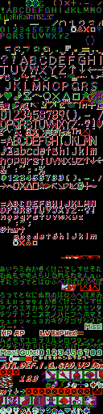
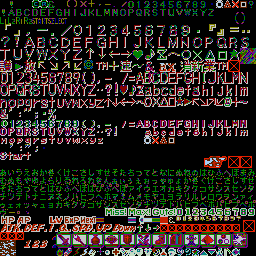
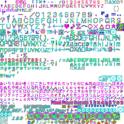

# bof3-translation-tool
Breath of Fire 3 Translation Tool

## Introduzione
Questo tool è stato sviluppato per spacchettare e reimpacchettare i file in formato EMI di Breath of Fire 3 PSX/PSP. 
Con ogni probabilità funziona anche con Breath of Fire 4 (almeno per la gestione degli EMI, non ho verificato testi/grafica).

Oltre alla gestione degli EMI supporta anche l'estrazione ed il reinserimento dei testi di gioco presenti nei file EMI e permette l'indicizzazione dei testi duplicati nei vari file in un unico file e, viceversa, ne permette l'espansione in multipli file.

Oltre a ciò ingloba anche la gestione della grafica RAW in TIM/BMP ed il riordinamento dei tile al loro interno (le RAW non sono "ordinate").

## Utilizzo
L'utilizzo del tool è molto semplice:

```
python bof3tool.py -h
```

Ad esempio mostrerà cosa è in grado di fare;

```
usage: bof3tool.py [-h] [-v] {unpack,pack,raw2tim,tim2raw,raw2bmp,bmp2raw,dump,reinsert,index,expand} ...

Breath of Fire III Tool (PSX/PSP)

positional arguments:
  {unpack,pack,raw2tim,tim2raw,raw2bmp,bmp2raw,dump,reinsert,index,expand}
                        Description
    unpack              unpack EMI files into BIN files
    pack                pack BIN files into EMI file
    dump                dump text from BIN file
    reinsert            reinsert text into BIN file
    index               index all texts into single file
    expand              expand an indexed file into multiple files
    raw2tim             convert graphic RAW to TIM (PSX)
    tim2raw             convert TIM (PSX) to graphic RAW
    raw2bmp             convert graphic RAW to BMP
    bmp2raw             convert BMP to graphic RAW

optional arguments:
  -h, --help            show this help message and exit
  -v, --version         show program's version number and exit
```

I comandi a disposizione sono:
* **unpack**: estrae il contenuto dei file EMI
* **pack**: ricostruisce il file EMI precedentemente estratto
* **dump**: estrae il testo da un file BIN
* **reinsert**: converte un file di testo in formato BIN
* **index**: indicizza più file di testo in un unico file (utile per i testi ripetuti)
* **expand**: espande un file indicizzato negli originali file di testo (testi ripetuti)
* **raw2tim**: converte un file grafico RAW in formato TIM riarraggiando i tile
* **tim2raw**: converte un file in formato TIM in grafica RAW riarraggiando i tile
* **raw2bmp**: converte un file grafico RAW in formato BMP riarraggiando i tile
* **bmp2raw**: converte un file in formato BMP in grafica RAW riarraggiando i tile

### Spacchettare file EMI
Per estrarre uno o più file EMI è sufficiente dare ad esempio un:
```
python bof3tool.py unpack -i BIN/WORLD00/*.EMI -o unpacked/WORLD00
```

Così facendo diremo di spacchettare tutti i file EMI contenuti nella cartella `BIN/WORLD00` all'interno della cartella `unpacked/WORLD00`.

All'interno ci troveremo una struttura composta da:
* un file JSON contenente le informazioni del file originale
* una cartella contenente i file estratti dall'EMI

Se al comando precedente aggiungiamo anche i parametri `--dump-txt` e `--dump-gfx` avremo inoltre:
* l'eventuale dump del testo rilevato in formato JSON (potrebbe non essere testo di gioco ma materiale di debug)
* la grafica esportata in formato BMP nei formati standard (potrebbero non essere giusti). Questo è utile solo per capire se può esserci della grafica da modificare.

Esempio di estrazione di un singolo file:
```
python bof3tool.py unpack -i AREA000.EMI -o unpacked --dump-txt --dump-gfx
```

Risultato:
```
--- Breath of Fire III Tool (PSX/PSP) ---

Unpacking AREA000.EMI into unpacked/AREA000.json and data blocks(14)...
unpacked/AREA000/AREA000.1.bin created.
unpacked/AREA000/AREA000.2.bin created.
unpacked/AREA000/AREA000.3.bin created.
unpacked/AREA000/AREA000.4.bin created.
unpacked/AREA000/AREA000.5.bin created.
unpacked/AREA000/AREA000.6.bin created.
Coverting RAW AREA000.6.bin in BMP unpacked/AREA000/AREA000.6.bin.4b.64w.64x16.128r.bmp using 4bpp, final width size 128 using tile of 64x16...
Done.
Coverting RAW AREA000.6.bin in BMP unpacked/AREA000/AREA000.6.bin.4b.128w.128x32.256r.bmp using 4bpp, final width size 256 using tile of 128x32...
Done.
Coverting RAW AREA000.6.bin in BMP unpacked/AREA000/AREA000.6.bin.8b.64w.64x16.128r.bmp using 8bpp, final width size 128 using tile of 64x16...
Done.
Coverting RAW AREA000.6.bin in BMP unpacked/AREA000/AREA000.6.bin.8b.128w.128x32.256r.bmp using 8bpp, final width size 256 using tile of 128x32...
Done.
unpacked/AREA000/AREA000.7.bin created.
unpacked/AREA000/AREA000.8.bin created.
Coverting RAW AREA000.8.bin in BMP unpacked/AREA000/AREA000.8.bin.4b.64w.64x16.128r.bmp using 4bpp, final width size 128 using tile of 64x16...
Done.
Coverting RAW AREA000.8.bin in BMP unpacked/AREA000/AREA000.8.bin.4b.128w.128x32.256r.bmp using 4bpp, final width size 256 using tile of 128x32...
Done.
Coverting RAW AREA000.8.bin in BMP unpacked/AREA000/AREA000.8.bin.8b.64w.64x16.128r.bmp using 8bpp, final width size 128 using tile of 64x16...
Done.
Coverting RAW AREA000.8.bin in BMP unpacked/AREA000/AREA000.8.bin.8b.128w.128x32.256r.bmp using 8bpp, final width size 256 using tile of 128x32...
Done.
unpacked/AREA000/AREA000.9.bin created.
unpacked/AREA000/AREA000.10.bin created.
unpacked/AREA000/AREA000.11.bin created.
unpacked/AREA000/AREA000.12.bin created.
Dumping text blocks (256) from unpacked/AREA000/AREA000.12.bin into unpacked/AREA000/AREA000.12.bin.json...
Text dumped.
unpacked/AREA000/AREA000.13.bin created.
unpacked/AREA000/AREA000.14.bin created.
EMI AREA000.EMI unpacked into 14 files.
```

### Reimpacchattare file EMI
Una volta estratti i file EMI nei rispettivi BIN è possibile ricostruirne uno o più EMI utilizzando il seguente comando:

```
python bof3tool.py pack -i unpacked/AREA000.json -o output
```

Il risultato che otterremo sarà:
```
--- Breath of Fire III Tool (PSX/PSP) ---

Packing unpacked/AREA000.json into output/AREA000.EMI...
output/AREA000.EMI created.
```

### Estrazione del testo
Per estrarre il testo di gioco si può utilizzare il comando `dump` sul file BIN contenente il testo:

```
python bof3tool.py dump -i unpacked/AREA000/AREA000.12.bin -o AREA000.12.bin.json
```

Il risultato che otterremo sarà:
```
--- Breath of Fire III Tool (PSX/PSP) ---

Dumping text blocks (256) from unpacked/AREA000/AREA000.12.bin into AREA000.12.bin.json...
Text dumped.
```

Il file JSON creato conterrà il testo codificato in UTF-8 e tutti i comandi (pause, posizioni, nomi etc) come ad esempio:

```json
[
    "<POS 81>   Spring in McNeil<TIME 20><END>",
    "\"Ah...spring...<END>",
    "\"It looks like it'll<NL>be a good crop this<NL>year...<CLEAR>That means we can<NL>take it easy this<NL>year!<END>",
    "\"Not only do we have<NL>to worry about bad<NL>crops...<CLEAR>In the country, we've<NL>got taxes to<NL>worry about too...<CLEAR>I wish I could move<NL>to a real city...<NL>like Wyndia<END>",
    "\"I guess y'all aren't<NL>as bad as I thought...<CLEAR>Good job!<END>",
    "\"What're you doing,<NL>this time of night?<CLEAR>Sleep during the day<NL>an' stay up all night?<NL>S'weird, if ya ask me<END>",
    ...
]
```

### Reinserimento testo
Allo stesso modo è possibile ricostruire un file BIN di testo partendo da un JSON utilizzando:

```
python bof3tool.py reinsert -i AREA000.12.bin.json -o AREA000.12.bin
```

Il risultato che otterremo sarà:
```
--- Breath of Fire III Tool (PSX/PSP) ---

Reinserting text blocks (256) from AREA000.12.bin.json into AREA000.12.bin...
Text reinserted.
```

Il nuovo file BIN ottenuto potrà essere reinserito nel file EMI.

### Indicizzazione dei testi
Moltissimi file di testo di Breath of Fire III contengono del testo ripetuto in quanto sono semplicemente le medesime scene con leggere variazioni (tempo/personaggi).

Al fine di evitare di ritradurre le stesse frasi più e più volte è possibile indicizzarle in un unico grande file che conterrà, di fatto, il testo di tutto il gioco più un file di "puntatori" per l'espansione futura.

Una volta raggruppati i JSON di tutti i testi in una cartella è sufficiente eseguire il seguente comando per indicizzare tutti i file:
```
python bof3tool.py index -i texts/*.json --output-strings strings_en.json --output-pointers pointers_en.json
```

Il risultato sarà ad esempio:
```
--- Breath of Fire III Tool (PSX/PSP) ---

Indexing 169 JSON files into strings_en.json/pointers_en.json...
Indexed 6365 strings (4475 repeated strings).
```

### Espansione testi indicizzati
Da un file di testo indicizzato e dai suoi "puntatori" è possibile riottenere i file JSON originali da poter ritrasformare nei BIN da reinserire negli EMI.

Per effettuare l'espansione si può utilizzare il seguente comando:
```
python bof3tool.py expand --input-strings strings_en.json --input-pointers pointers_en.json -o expanded
```

Il comando ricostruirà i file JSON originale all'interno della cartella `expanded`:

```
--- Breath of Fire III Tool (PSX/PSP) ---

Expanding 169 files using 6366 strings...
File AREA000.12.bin.json with 256 strings recreated.
File AREA001.12.bin.json with 256 strings recreated.
File AREA002.8.bin.json with 256 strings recreated.
...
File AREA198.12.bin.json with 256 strings recreated.
File AREA199.12.bin.json with 256 strings recreated.
Expanded 169 files with a total of 10840 strings.
```

### Conversione grafica RAW in TIM/BMP
Tramite le funzioni `raw2tim` e `raw2bmp` è possibile convertire la grafica RAW in TIM/BMP e riarrangiare le tile internamente.

Per spiegarne il funzionamento e mostrarne l'utilizzo prenderemo come esempio il file `ETC/ENDKANJI.EMI` della versione PSX.
Iniziamo con estrarne il suo contenuto:

```
python bof3tool.py unpack -i ENDKANJI.EMI   
```

Otterremo:
```
--- Breath of Fire III Tool (PSX/PSP) ---

Unpacking ENDKANJI.EMI into ENDKANJI.json and data blocks(2)...
ENDKANJI/ENDKANJI.1.bin created.
ENDKANJI/ENDKANJI.2.bin created.
EMI ENDKANJI.EMI unpacked into 2 files.
```
I due file BIN contengono entrambi grafica RAW.

Vediamo quindi cosa è possibile fare con la funzione `raw2bmp`:

```
python bof3tool.py raw2bmp -h
```

```
usage: bof3tool.py raw2bmp [-h] -i [INPUT ...] [-o OUTPUT] --bpp {4,8} --width {64,128,256,512} [--tile-width TILE_W] [--tile-height TILE_H] [--resize-width RESIZE_WIDTH]
                           [--negative]

optional arguments:
  -h, --help            show this help message and exit
  -i [INPUT ...], --input [INPUT ...]
                        input .BIN (RAW) files
  -o OUTPUT, --output OUTPUT
                        output .BMP file
  --bpp {4,8}           bits per pixel
  --width {64,128,256,512}
                        image width
  --tile-width TILE_W   tile width
  --tile-height TILE_H  tile height
  --resize-width RESIZE_WIDTH
                        resize width
  --negative            negative colors
```

Possiamo quindi provare a convertire il primo dei due in TIM o BMP usando:
```
python bof3tool.py raw2bmp -i ENDKANJI/ENDKANJI.1.bin --bpp 4 --width 128
````

> Per ottenere una TIM è sufficiente utilizzare `raw2tim` con gli stessi parametri

Otterremo una BMP:
```
--- Breath of Fire III Tool (PSX/PSP) ---

Coverting RAW ENDKANJI.1.bin in BMP ENDKANJI/ENDKANJI.1.bin.4b.128w.bmp using 4bpp, size 128x512...
Done.
```

L'immagine che otterremo sarà la seguente:



Come si può notare l'immagine è corretta a livello di impostazioni ma è evidente che è suddivisa internamente in tile da 128x32 (il secondo blocco in verticale dovrebbe essere in realtà spostato a destra del primo blocco) secondo questo criterio:
- Tile 1
- Tile 2
- Tile 3
- Tile 4
- Tile 5
- Tile 6
- Tile 7
- Tile 8
- ...

Dovrebbe diventare:
- Tile 1 - Tile 2
- Tile 3 - Tile 4
- Tile 5 - Tile 6
- Tile 7 - Tile 8
- ...

Ecco quindi che è possibile riarrangiare le tile internamente specificando la dimensione delle tile (128x32 in questo caso) e la larghezza finale dell'immagine (256):

```
python bof3tool.py raw2bmp -i ENDKANJI/ENDKANJI.1.bin --bpp 4 --width 128 --tile-width 128 --tile-height 32 --resize-width 256
```

Otterremo:
```
--- Breath of Fire III Tool (PSX/PSP) ---

Coverting RAW ENDKANJI.1.bin in BMP ENDKANJI/ENDKANJI.1.bin.4b.128w.128x32.256r.bmp using 4bpp, final width size 256 using tile of 128x32...
Done.
```

La nuova immagine riarrangiata sarà:



Decisamente meglio, no?

> Quando si lavora con le BMP è possibile passare il parametro `--negative` per utilizzare una palette dei colori negativa, ad esempio:
> 
> 
> Con le TIM ciò non è necessario in quanto le TIM generate possiedono già le due palette all'interno.

### Conversione grafica TIM/BMP in RAW
Tramite le funzioni `tim2raw` e `bmp2raw` possiamo effettuare il processo inverso al precedente.

I parametri sono praticamente gli stessi:

```
python bof3tool.py bmp2raw -h
```

```
usage: bof3tool.py bmp2raw [-h] -i [INPUT ...] [-o OUTPUT] --bpp {4,8} [--tile-width TILE_W] [--tile-height TILE_H] [--resize-width RESIZE_WIDTH]

optional arguments:
  -h, --help            show this help message and exit
  -i [INPUT ...], --input [INPUT ...]
                        input .BMP file files
  -o OUTPUT, --output OUTPUT
                        output .BIN (RAW)
  --bpp {4,8}           bits per pixel
  --tile-width TILE_W   tile width
  --tile-height TILE_H  tile height
  --resize-width RESIZE_WIDTH
                        resize width
```

Seguendo l'esempio precedente possiamo riottenere il file RAW (BIN) eseguendo un:

```
python bof3tool.py bmp2raw -i ENDKANJI.1.bin.4b.128w.128x32.256r.bmp -o ENDKANJI.1.bin --bpp 4 --tile-width 128 --tile-height 32 --resize-width 256
```

Otterremo:
```
--- Breath of Fire III Tool (PSX/PSP) ---

Coverting BMP ENDKANJI.1.bin.4b.128w.128x32.256r.bmp in RAW graphic ENDKANJI.1.bin using 4bpp, final width size 256 using tile of 128x32...
Done.
```

Ed ecco che il file `ENDKANJI.1.bin` è pronto ad essere reinserito nell'EMI originale.

> Anche in questo caso il processo con le TIM è il medesimo utilizzando `raw2tim`.
> 
> Attenzione: se state convertendo una BMP "negativa" non c'è bisogno di specificare alcun ulteriore parametro in quanto la palette dei colori non è presente nella RAW.